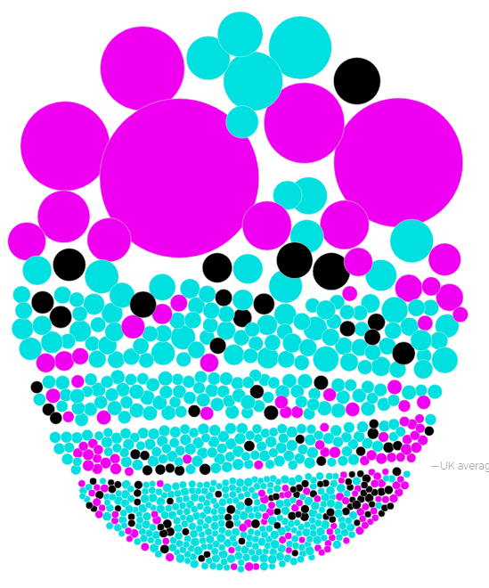
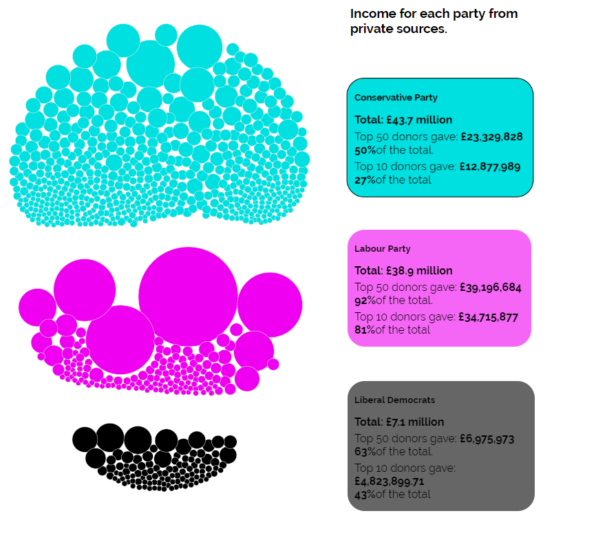
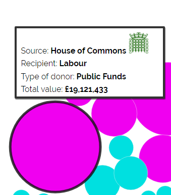
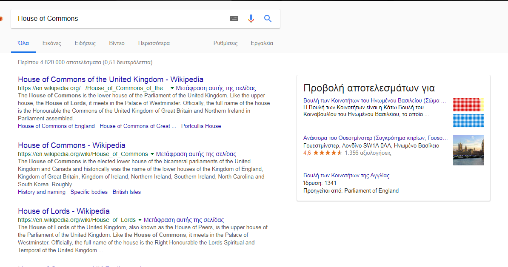
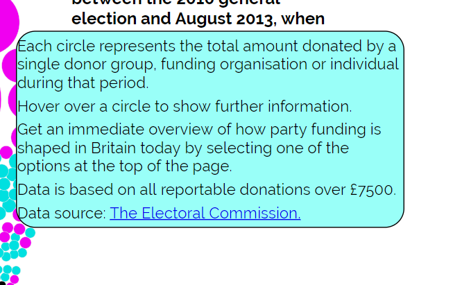
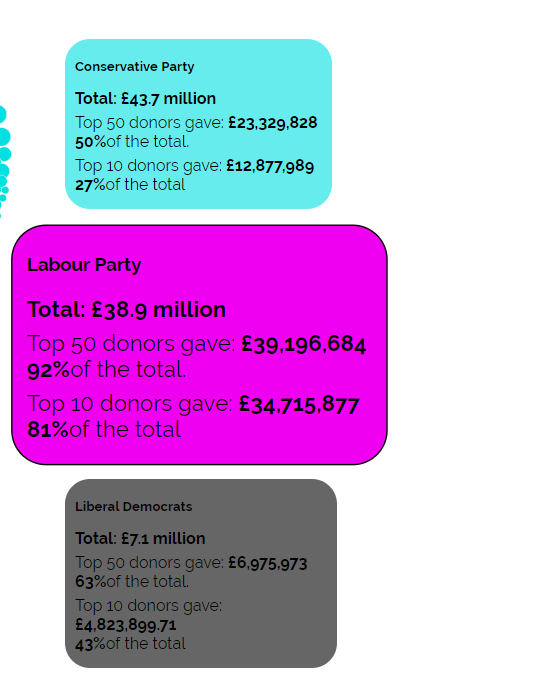
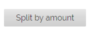
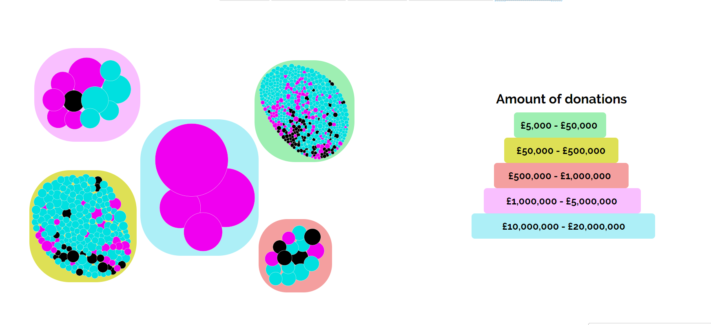
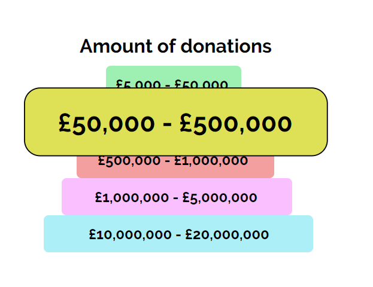

## ΣΤΟΙΧΕΙΑ ΦΟΙΤΗΤΗ

```markdown
ΟΝΟΜΑΤΕΠΩΝΥΜΟ: Τασιόπουλος Εμμανουήλ
ΑΡΙΘΜΟΣ ΜΗΤΡΩΟΥ: Π2015046
```

## ΣΥΝΔΕΣΜΟΙ

- Open Page [HERE](https://manolis-tasiopoulos.github.io/D3js-uk-political-donations/)            
- Repository [HERE](https://github.com/Manolis-Tasiopoulos/D3js-uk-political-donations)

## ΕΙΣΑΓΩΓΗ
 Σε αυτό το εξάμηνο κλιθήκαμε να τροποποιήσουμε και να ολοκληρώσουμε από κοινού μια σελίδα η οποία αναφέρεται σε χορηγίες του Ηνωμένου Βασιλείου. Οι αλλαγές στη σελίδα έγιναν υπό την καθοδήγηση παραδοτέων τα οποία ζητούσαν συγκεκριμένες τροποποιήσεις από τον καθένα. Στόχος της εργασίας είναι η εξοικείωση του χρήστη γύρω από το κομμάτι της html, της javascript και css. Επίσης, ζητούμενο της εργασίας είναι και η εξοικείωση του χρήστη με την οπτικοποίηση των δεδομένων, βάσει της d3 βιβλιοθήκης της javascript.

## ΣΥΝΟΨΗ
  
   - __Αλλαγή χρωμάτων__   
   - __Προσθηκη ήχου καθε φορα που ο χρήστης της εφαρμογής κάνει κλικ σε μία από τις επιλογές__ 
   - __Προσθήκη animation όταν ο χαρακτήρας κινείται προς οποιαδήποτε κατευθυνση__ 
   - __Αναζήτηση δωρητών στο Google με κλικ στις μπάλες των δεδομένων__
   - __Προσθήκη επιλογής μεγένθησης όταν ο χρήστης περνάει με το ποντίκι πάνω απο ένα κείμενο__
   - __Ηχιτική βοήθεια όταν ο χρήστης περνάει με το ποντίκι πάνω από τις μπάλες των δεδομένων__
   - __Δημιουργία νέας επιλογής Split by amount:__
   
 ## ΕΠΙΛΟΓΗ ΕΡΓΑΛΕΙΩΝ
Τα εργαλεια τα οποια χρησιμοποιηθηκαν ειναι τα εξης: 
  
  - __BRACKETS__
  
  ```markdown  
  IDE για τη συγγραφη του κωδικα
  ```
  - __PHOTOSHOP__
  
  ```markdown
  Προγραμμα επεξεργασιας εικονων για την προσαρμογή των εικόνων
  ```  
  
## ΔΙΑΔΙΚΑΣΙΑ ΑΝΑΠΤΥΞΗΣ

- __Αλλαγή χρωμάτων:__    
      * Στις μπάλες με τα δεδομένα<br>
   
   
     * Στα πεδία ομαδοποίησης Split by party<br>
   
   
   
  - __Προσθηκη ήχου καθε φορα που ο χρήστης της εφαρμογής κάνει κλικ σε μία από τις επιλογές__
   
  - __Αναζήτηση δωρητών στο Google με κλικ στις μπάλες των δεδομένων__
      
   ```
   search
   ```
   
   - __Προσθήκη επιλογής μεγένθησης όταν ο χρήστης περνάει με το ποντίκι πάνω απο ένα κείμενο__
      
   ```
   Zoom
   ```
  
  - __Ακούγεται το όνομα και το ποσό των δωρητών όταν ο χρήστης περνάει με το ποντίκι πάνω από τις μπάλες των δεδομένων__
  
  - __Δημιουργία νέας επιλογής Split by amount:__  
    * Ομαδοποίηση των δεδομένων με βάση το ποσό των δωρεών
     
     ```
     button
     ```
     
     ```
     Split
     ```
     
     ```
     zoom
     ```
   - __Προσθήκη των στοιχείων μου σε κοινο index file:__  
     
     
     ```
     My data
     ```
     
## ΣΥΜΠΕΡΑΣΜΑΤΑ
Με τις αλλαγές αυτές ολοκληρώνεται η εργασία του ΣΤ Εξαμήνου του μαθήματος Τεχνολογία λογισμικου.Η συγκεκριμένη εργασία ήταν πολύ καλή δυνατότητα προκειμένου να ασχοληθούμε και να αναπτύξουμε περαιτέρω τις γνώσεις μας πάνω στη δημιουργία html σελίδων αλλά και στην εξοικείωση μας με τη γλώσσα προγραμματισμού javascript.
